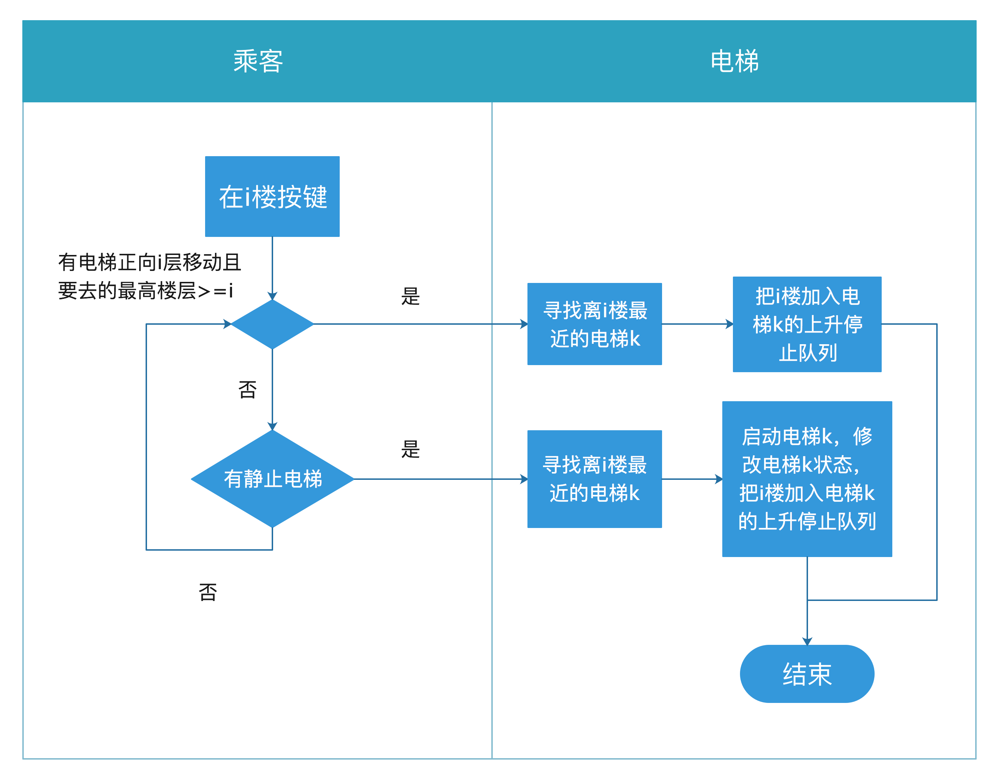
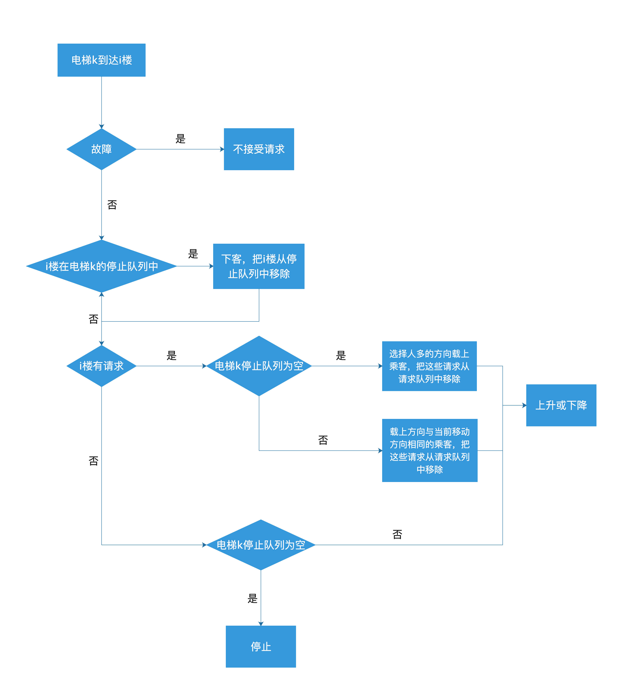

# Elevator Scheduling

电梯调度，预览：运行 `elevator.jar` 。

## 开发环境

语言：`Java`

IDE：`Intellij IDEA`

## 需求分析

现实中的电梯，乘客应在电梯外选择上行键或下行键，进入电梯后选择对应楼层。本项目对此进行了简化，乘客可以在进入电梯前直接选择楼层。

因此可将需求分为如下方面：

### 乘客

- 对于每一层，能够按下楼层选择按钮，到达其想去的楼层。可选择的楼层为1-20层，共20层 
- 可按任意电梯警报键，使其处于故障状态
- 可控制电梯开关门

### 对于电梯

- 当请求发出后，调度系统会立即选择一个电梯，将该请求加入该电梯的响应队列，并在之后完成该请求，除非所有电梯处于故障状态，否则请求将肯定被实现
- 如果电梯故障，它将停在当前楼层且不接受任何请求
- 电梯开门时不移动。考虑到紧急情况，若电梯在运行中收到开门请求，将在最近楼层停下。
- 电梯到达每个楼层都应检查是否需要上下客，如果需要则在该楼层停顿一定时间
- 电梯当前所处的楼层和其运行状态能够在界面上显示 
- 在没有被请求时，电梯将在原地保持不动

## 算法实现

### 响应请求算法  ` ui.elevatorManager（）`

当第i楼有乘客按下按钮发出请求：

#### 上升请求

1. 若有一个或多个当前所在楼层低于i楼的电梯正在向i层上升，且它们目前要去最高楼层高于或等于i楼，则这些电梯中离i楼最近的电梯k将相应该请求，把i楼加入电梯k的上升停止队列，乘客将等待电梯k上升到i楼来载上他们
2. 若没有所在楼层低于i楼且正在向i层上升的电梯，或有这样的电梯但它们要去的最高楼层低于i楼，但有静止的电梯，则静止的电梯中离i楼最近的电梯k将相应该请求，启动电梯k，修改当前状态，把i楼加入电梯k的上升停止队列，乘客将等待电梯k上升到i楼来载上他们
3. 若没有电梯符合上述情况，则等待符合情况的电梯出现

#### 下降请求

1. 若有一个或多个当前所在楼层高于i楼的电梯正在向i层下降，且它们目前要去最低楼层低于或等于i楼：
   - 这些电梯中离i楼最近的电梯k将相应该请求，把i楼加入电梯k的下降停止队列，乘客将等待电梯k下降到i楼来载上他们
2. 若没有所在楼层高于i楼且正在向i层下降的电梯，或有这样的电梯但它们要去的最低楼层高于i楼，但有静止的电梯：
   - 静止的电梯中离i楼最近的电梯k将相应该请求，启动电梯k并把i楼加入电梯k的下降停止队列，乘客将等待电梯k上升到i楼来载上他们
3. 若没有电梯符合上述情况，则等待符合情况的电梯出现

#### 响应请求流程图

### 实现请求算法 ` elevator().run()`

当电梯k到达第i楼:

1. 故障的电梯将不会接受任何请求

2. 检查电梯k的停止队列

   - i楼在电梯k的停止队列中：
     - 在i楼停顿一顿时间以下客，把i楼从停止队列中移除，进行下一步
   - i楼不在电梯k的停止队列中：
     - 进行下一步

3. 检查i楼的请求队列

   - i楼有请求：
     - 电梯k当前停止队列为空：
       - 在i楼停顿一段时，选择人多的方向载上乘客，把这些请求从请求队列中移除，修改当电梯k当前状态，向该方向移动
     - 电梯k当前停止队列不为空：
       - 在i楼停顿一段时间，载上方向与当前移动方向相同的乘客，把这些请求从请求队列中移除，继续移动
   - i楼无请求：
     - 电梯k当前停止队列为空：
       - 修改当电梯k当前状态，电梯停止
     - 电梯k当前停止队列不为空：
       - 继续移动

   

#### 实现请求流程图

## 类、函数、变量解释

#### `elevetor.java`

|          名称          |                      说明                      |
| :--------------------: | :--------------------------------------------: |
|        int name        |                 电梯名（1-5）                  |
|   int currentState;    |  该电梯当前运动状态 停止：0 上升：1 下降：-1   |
|     int emerState;     |                    紧急状态                    |
|   int currentFloor;    |               该电梯当前所在层数               |
|  int currentMaxFloor;  |           该电梯当前可去的最高的楼层           |
|       int maxUp;       |              该电梯要去的最高楼层              |
|      int minDown;      |              该电梯要去的最低楼层              |
| int getCurrentState()  |        获取电梯当前运动状态currentState        |
| void setCurrentState() |        修改电梯当前运动状态currentState        |
| int getCurrentFloor()  |        获取电梯当前所在楼层currentFloor        |
| void setCurrentFloor() |        修改电梯当前所在楼层currentFloor        |
|      void popUp()      |  将电梯上升停止队列upStopList的第一个元素弹出  |
|  void addUp(int pos)   |      将楼层pos加入上升停止队列upStopList       |
|     void popDown()     | 将电梯下降停止队列downStopList的第一个元素弹出 |
| void addDown(int pos)  |     将楼层pos加入下降停止队列downStopList      |
|      int upMax()       |          获取电梯会去的最高楼层maxUp           |
|    void setUpMax()     |          设置电梯会去的最高楼层maxUp           |
|     int downMin()      |         获取电梯会去的最低楼层minDown          |
|   void setDownMin()    |         设置电梯会去的最低楼层minDown          |
|       void run()       |                    启动电梯                    |

#### `ui.java`

|                 名称                 |           说明           |
| :----------------------------------: | :----------------------: |
|                JLabel                |         楼层标签         |
|              JComboBox               |  上升选择键 20层（0-19   |
|              JComboBox               | 下降选择键 20层（0-19）  |
|               JButton                |  5部电梯 20层楼（0-19）  |
|               TextArea               |       右方文字显示       |
| elevator one, two, three, four, five |      分别为5部电梯       |
|              elevators               |         电梯队列         |
|               upqueue                |       上升等待队列       |
|              downqueue               |       下降等待队列       |
|              upqueLock               | 上升队列锁 20层（0-19）  |
|             downqueLock              | 下降队列锁 20层（0-19）  |
|             void init()              |          初始化          |
|          class lightManger           | 控制停止的电梯的亮灯状态 |
|        class elevatorManager         |     控制电梯相应请求     |

## 现存问题

- 开关门设计得有点问题，比如没有处理一直开门占用电梯的情况（但据我观察现实中的电梯似乎的确不会处理这个问题）；
