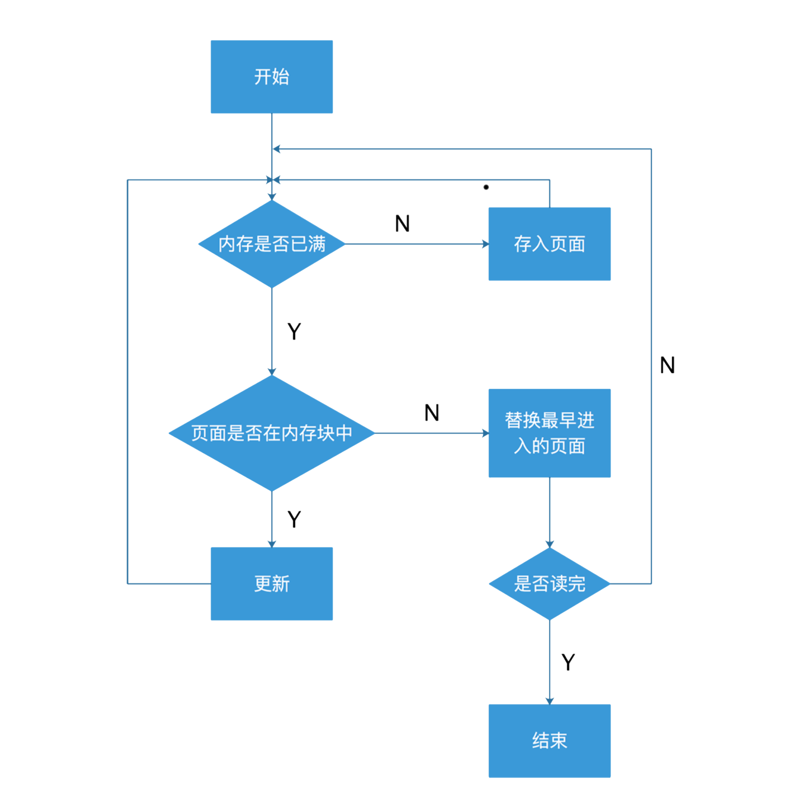
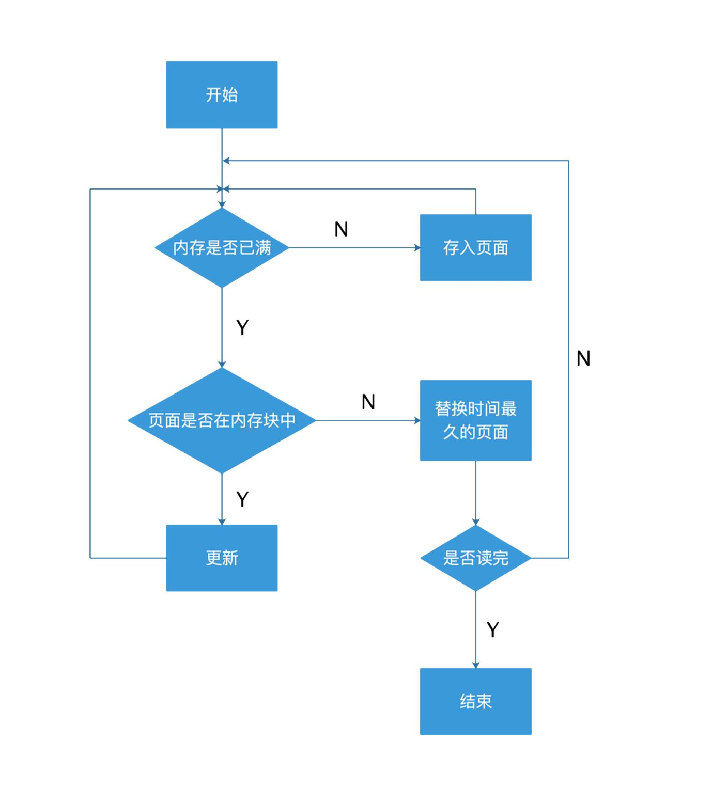

# Memory Management

内存管理 / 请求调页模拟。

预览：https://renovamen.github.io/Operating-System

## 开发环境

语言：`HTML` `CSS` `JS`

## 算法实现

### FIFO (First Input First Output) `function FIFO()`

总是淘汰最先进入内存的页面（即在内存中驻留时间最久的页面）。

#### 模拟过程

- 当页面被置换进入内存时，将置换页面所在的物理块的访问标记设为-1；
- 每执行一次指令，物理块的访问标记都会自动加1；

- 需要置换时将访问标记最大的物理块中的页面置换出去。

#### 缺陷

性能较差，较早调入的页往往是经常被访问的页，这些页在FIFO算法中被反复调入和调出。

#### FIFO算法流程图

### LRU (Least Recently Used) `function LRU()`

以最近的过去作为不久将来的近似，将过去最长一段时间里不曾被使用的页面置换掉。

#### 模拟过程

- 当物理块中的页面被访问时（包括原先存在的和后来置换进入的页面），都将其物理块的访问标记设为-1；
- 每执行一次指令，都将物理块中各页面的访问标记加1；

- 需要置换时将访问标记最大的物理块中的页面置换出去。

#### 缺陷

由于需要记录页面使用时间的先后顺序，硬件开销太大。

#### LRU算法流程图

## 函数、变量解释

`main.js`

| 名称 | 说明 |
|--------|-------|
| function flagInstructionExecuted()|判断选中指令是否被运行过|
| function flagInstructionAvailable()|判断选中指令是否在内存中|
| function Pre()|初始化|
| function FIFO() |FIFO算法|
| function LRU() |LRU算法|
| function chooseAlgrithm()|选择使用哪个算法|
| var startBtn |获取"开始"按钮|
| var memoryBlockNumber|内存块数|
| var instructionNumber|总指令数|
| var numberOfInstructionsInEachPage|每页存放指令数|
| var currentInstructionSpan|当前指令|
| var numberOfMissingPagesSpan|缺页数|
| var pageFaultRateSpan|缺页率|
| var memory|内存|
| var instructions|指令是否被执行|
| var insCount|记录执行的指令个数|
| var missingPage|缺页个数|
